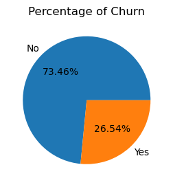
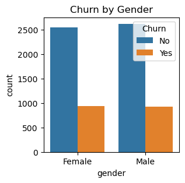
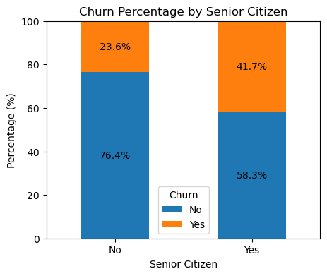
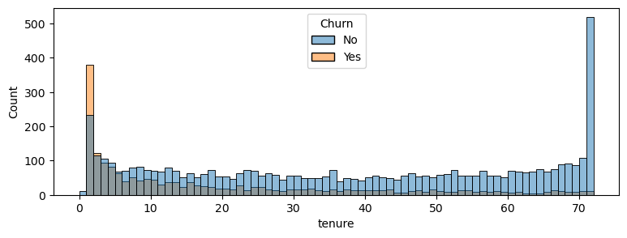
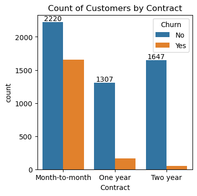
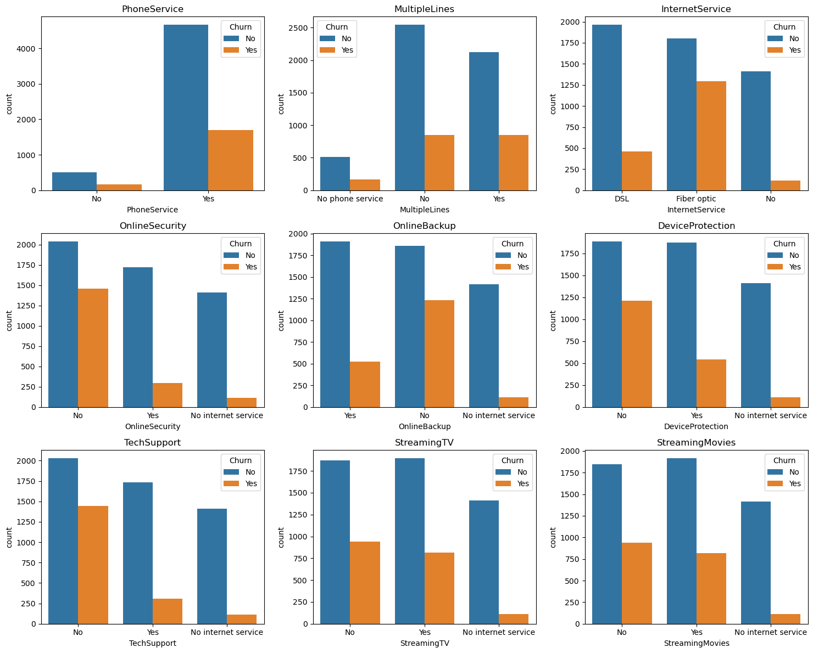
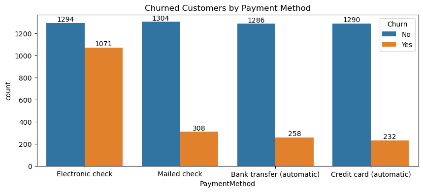

# Customer Churn Analysis

## Overview

This project analyzes customer churn using the **Telco Customer Churn** dataset. The objective is to understand customer behavior and identify the factors associated with customers leaving a telecommunications service.

The project uses **Python, Pandas, NumPy, Matplotlib, Seaborn, and Jupyter Notebook** to perform data preprocessing and exploratory data analysis (EDA).

---

## Objectives

* Analyze customer churn patterns.
* Understand customer demographics and service-related characteristics.
* Identify factors associated with higher customer churn.
* Perform data cleaning and preprocessing.
* Visualize important relationships within the dataset.
* Generate insights that can support customer retention analysis.

---

## Dataset

The project uses the **Telco Customer Churn** dataset.

The dataset contains:

* **7,043 customer records**
* **21 attributes**

Important variables include:

* Customer ID
* Gender
* Senior Citizen
* Partner
* Dependents
* Tenure
* Phone Service
* Multiple Lines
* Internet Service
* Online Security
* Online Backup
* Device Protection
* Tech Support
* Streaming TV
* Streaming Movies
* Contract
* Paperless Billing
* Payment Method
* Monthly Charges
* Total Charges
* Churn

The target variable is **Churn**, which indicates whether a customer has left the service.

---

## Technologies Used

* Python
* Pandas
* NumPy
* Matplotlib
* Seaborn
* Jupyter Notebook

---

## Project Workflow

The project follows these major steps:

1. Import required Python libraries
2. Load the dataset
3. Understand the structure of the data
4. Check data types and missing values
5. Handle values in the `TotalCharges` column
6. Check duplicate records
7. Convert `SeniorCitizen` values into categorical labels
8. Perform exploratory data analysis
9. Create visualizations
10. Analyze factors associated with customer churn
11. Summarize the major findings

---

## Data Preprocessing

The dataset was checked for missing values and duplicate records.

The `TotalCharges` column contained blank values, which were replaced with zero and converted into numeric format.

Duplicate records and duplicate customer IDs were also checked. No duplicate records were found.

The `SeniorCitizen` variable was originally represented using `0` and `1`. It was converted into:

* `0 → No`
* `1 → Yes`

This made the data easier to interpret during analysis.

---

## Exploratory Data Analysis

### Overall Churn

The analysis shows that:

* **73.46%** of customers did not churn.
* **26.54%** of customers churned.



---

### Churn by Gender

The project compares churn between male and female customers.

The analysis does not show gender as a major distinguishing factor for churn.



---

### Churn by Senior Citizen Status

Customer churn was analyzed based on senior citizen status.

The analysis shows a comparatively higher churn proportion among senior citizens.



---

### Churn and Tenure

Customer tenure was analyzed to understand whether the length of the customer relationship is associated with churn.

The analysis indicates that customers with relatively short tenure are more frequently associated with churn.



---

### Churn by Contract Type

The dataset contains three major contract types:

* Month-to-month
* One year
* Two year

Month-to-month customers show considerably higher churn compared with customers having longer-term contracts.



---

### Churn by Services

The project analyzes customer churn across different services such as:

* Internet Service
* Online Security
* Online Backup
* Device Protection
* Tech Support
* Streaming TV
* Streaming Movies

The analysis indicates comparatively higher churn among fiber-optic users and among customers without certain additional support and protection services.



---

### Churn by Payment Method

The project compares churn across different payment methods:

* Electronic Check
* Mailed Check
* Bank Transfer (Automatic)
* Credit Card (Automatic)

Customers using electronic checks show comparatively higher churn in the analysis.



---

## Key Findings

| Factor            | Observation                                           |
| ----------------- | ----------------------------------------------------- |
| Overall Churn     | 26.54% of customers churned                           |
| Gender            | No major difference highlighted                       |
| Senior Citizen    | Comparatively higher churn                            |
| Tenure            | Short-tenure customers show more churn                |
| Contract          | Month-to-month customers show higher churn            |
| Internet Service  | Fiber-optic users show higher churn                   |
| Online Security   | Customers without the service tend to show more churn |
| Tech Support      | Customers without the service tend to show more churn |
| Device Protection | Customers without the service tend to show more churn |
| Payment Method    | Electronic check shows comparatively higher churn     |

---

## Conclusion

This project provides an exploratory analysis of customer churn in a telecommunications dataset.

The analysis shows that customer churn is associated with several customer and service characteristics. In particular, short tenure, month-to-month contracts, senior citizen status, fiber-optic internet service, absence of certain additional services, and electronic-check payment are associated with comparatively higher churn in the analyzed data.

The results demonstrate how exploratory data analysis and visualization can be used to understand customer behavior and identify important churn-related patterns.

---

## Limitations

This project currently focuses on **data preprocessing and exploratory data analysis**.

It does not include:

* Machine Learning model training
* Train/Test split
* Churn prediction
* Accuracy measurement
* Precision, Recall, or F1-score
* Confusion Matrix
* ROC-AUC analysis
* Feature importance from a predictive model

---

## Future Scope

The project can be extended by adding machine-learning models such as:

* Logistic Regression
* Decision Tree
* Random Forest
* Gradient Boosting
* XGBoost

The future version can also include model comparison, hyperparameter tuning, feature importance, prediction of high-risk customers, and a dashboard for interactive churn analysis.

---

## Project Structure

```text
Customer-Churn-Analysis/
│
├── README.md
├── PROJECT_REPORT.md
├── Customer_churn_analysis.ipynb
├── requirements.txt
├── .gitignore
│
└── images/
    ├── churn-percentage.png
    ├── churn-by-gender.png
    ├── churn-by-senior-citizen.png
    ├── churn-by-tenure.png
    ├── churn-by-contract.png
    ├── churn-by-services.png
    └── churn-by-payment-method.png
```

---

## How to Run the Project

### 1. Clone the repository

```bash
git clone https://github.com/your-username/Customer-Churn-Analysis.git
```

### 2. Open the project folder

```bash
cd Customer-Churn-Analysis
```

### 3. Install required libraries

```bash
pip install -r requirements.txt
```

### 4. Open the Jupyter Notebook

```bash
jupyter notebook Customer_churn_analysis.ipynb
```

### 5. Run the notebook

Execute the cells sequentially to reproduce the analysis and visualizations.

---

## Project Type

**Data Analysis | Exploratory Data Analysis | Customer Churn Analysis | Python**

---

## Author

**Dheeraj Kumar**

---

## Acknowledgement

This project was developed for learning and demonstrating practical skills in data analysis, data preprocessing, visualization, and customer churn analysis using Python.
